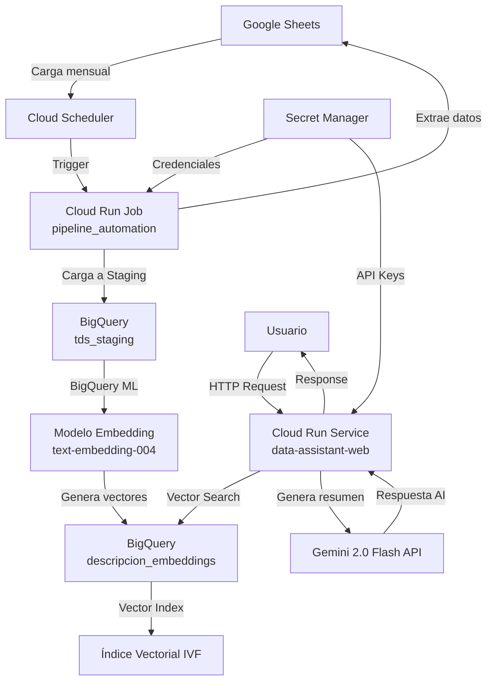

# Data Assistant - Implementación en GCP


Sistema de búsqueda semántica en catálogo de datos usando BigQuery ML y Gemini 2.0.

## 📋 Índice

- [Descripción General](#-descripción-general)
- [Arquitectura](#-arquitectura)
- [Componentes del Proyecto](#-componentes-del-proyecto)
- [Prerequisitos](#-prerequisitos)
- [Configuración Inicial](#-configuración-inicial)
- [Implementación](#-implementación)
- [Verificación](#-verificación)
- [Operación y Mantenimiento](#-operación-y-mantenimiento)
- [Troubleshooting](#-troubleshooting)

---

## 🎯 Descripción General

Este proyecto implementa un asistente de datos inteligente que permite búsquedas semánticas en un catálogo de datos utilizando tecnologías de Google Cloud Platform.

**Características principales:**
- ✨ Búsqueda semántica vectorial usando BigQuery ML
- 🤖 Generación de resúmenes inteligentes con Gemini 2.0
- 📊 Indexación automática de embeddings
- 🔄 Pipeline de carga mensual automatizada
- 🌐 Interfaz web FastAPI con frontend moderno

---

## 🏗️ Arquitectura



---

## 📦 Componentes del Proyecto

### 1️⃣ Pipeline Automation (Cloud Run Job)
- **Ubicación:** `pipeline_automation/`
- **Propósito:** Carga batch mensual de datos desde Google Sheets a BigQuery
- **Tecnologías:** Python 3.9, gspread, BigQuery ML
- **Despliegue:** Cloud Run Job + Cloud Scheduler
- **Frecuencia:** 1 vez al mes (configurable)

**Flujo de trabajo:**
1. Conecta a Google Sheets
2. Limpia y valida datos
3. Carga a tabla staging en BigQuery
4. Genera embeddings con modelo remoto (Vertex AI)
5. Crea índice vectorial para búsqueda rápida

### 2️⃣ Data Assistant Web (Cloud Run Service)
- **Ubicación:** `data-assistant-web/`
- **Propósito:** API y frontend para búsqueda semántica
- **Tecnologías:** FastAPI, Uvicorn, Jinja2, Gemini 2.0
- **Despliegue:** Cloud Run Service (HTTP)
- **Escalado:** Automático según demanda

**Funcionalidades:**
- Endpoint `/api/search`: Búsqueda vectorial en BigQuery
- Endpoint `/`: Interfaz web HTML
- Integración con Gemini para resúmenes inteligentes

---

## ⚙️ Prerequisitos

### Recursos GCP requeridos:
- ✅ Proyecto de GCP activo
- ✅ Facturación habilitada
- ✅ APIs habilitadas:
  - Cloud Run Admin API
  - Cloud Scheduler API
  - Cloud Build API
  - BigQuery API
  - Secret Manager API
  - Vertex AI API

### Herramientas locales:
- Google Cloud CLI (`gcloud`)
- Python 3.9+
- Git

---

## 🚀 Configuración Inicial

### 1. Configurar proyecto GCP

```bash
# Definir variables de entorno
export GCP_PROJECT_ID="tu-proyecto-gcp"
export REGION="us-central1"  # o tu región preferida
export DATASET_ID="catalogo_datos"
export TABLE_ID="descripcion_embeddings"
export STAGING_TABLE_ID="tds_staging"

# Autenticarse en GCP
gcloud auth login
gcloud config set project $GCP_PROJECT_ID

# Habilitar APIs necesarias
gcloud services enable \
  run.googleapis.com \
  cloudscheduler.googleapis.com \
  cloudbuild.googleapis.com \
  bigquery.googleapis.com \
  secretmanager.googleapis.com \
  aiplatform.googleapis.com
```

### 2. Crear dataset en BigQuery

```bash
# Crear dataset
bq mk --dataset \
  --location=$REGION \
  --description="Catálogo de datos con embeddings" \
  $GCP_PROJECT_ID:$DATASET_ID

# Verificar creación
bq ls
```

### 3. Crear conexión a Vertex AI

```bash
# Crear conexión para BigQuery ML
bq mk --connection \
  --location=$REGION \
  --project_id=$GCP_PROJECT_ID \
  --connection_type=CLOUD_RESOURCE \
  vertex-conn

# Obtener Service Account de la conexión
bq show --connection $GCP_PROJECT_ID.$REGION.vertex-conn

# Guardar el Service Account (será algo como bqcx-xxx@gcp-sa-bigquery-condel.iam.gserviceaccount.com)
export VERTEX_SA="<service-account-de-la-conexion>"

# Otorgar permisos necesarios
gcloud projects add-iam-policy-binding $GCP_PROJECT_ID \
  --member="serviceAccount:$VERTEX_SA" \
  --role="roles/aiplatform.user"
```

### 4. Configurar credenciales

#### Para Pipeline Automation:

```bash
# Crear cuenta de servicio
gcloud iam service-accounts create data-assistant-pipeline \
  --display-name="Data Assistant Pipeline"

export SA_EMAIL="data-assistant-pipeline@$GCP_PROJECT_ID.iam.gserviceaccount.com"

# Asignar roles necesarios
gcloud projects add-iam-policy-binding $GCP_PROJECT_ID \
  --member="serviceAccount:$SA_EMAIL" \
  --role="roles/bigquery.dataEditor"

gcloud projects add-iam-policy-binding $GCP_PROJECT_ID \
  --member="serviceAccount:$SA_EMAIL" \
  --role="roles/bigquery.jobUser"

# Generar archivo de credenciales JSON
gcloud iam service-accounts keys create credentials.json \
  --iam-account=$SA_EMAIL

# Almacenar en Secret Manager
gcloud secrets create pipeline-credentials \
  --data-file=credentials.json

# Dar acceso al secret a Cloud Run
gcloud secrets add-iam-policy-binding pipeline-credentials \
  --member="serviceAccount:$SA_EMAIL" \
  --role="roles/secretmanager.secretAccessor"
```

#### Para Data Assistant Web:

```bash
# Crear o usar API Key de Gemini
# Ir a https://aistudio.google.com/app/apikey
# Copiar la API Key

# Almacenar en Secret Manager
echo -n "TU_GEMINI_API_KEY" | gcloud secrets create gemini-api-key --data-file=-

# Crear cuenta de servicio para el servicio web
gcloud iam service-accounts create data-assistant-web \
  --display-name="Data Assistant Web"

export WEB_SA_EMAIL="data-assistant-web@$GCP_PROJECT_ID.iam.gserviceaccount.com"

# Asignar permisos
gcloud projects add-iam-policy-binding $GCP_PROJECT_ID \
  --member="serviceAccount:$WEB_SA_EMAIL" \
  --role="roles/bigquery.dataViewer"

gcloud projects add-iam-policy-binding $GCP_PROJECT_ID \
  --member="serviceAccount:$WEB_SA_EMAIL" \
  --role="roles/bigquery.jobUser"

# Dar acceso al secret de Gemini
gcloud secrets add-iam-policy-binding gemini-api-key \
  --member="serviceAccount:$WEB_SA_EMAIL" \
  --role="roles/secretmanager.secretAccessor"
```

### 5. Configurar Google Sheets

En tu Google Sheet:
1. Compartir la hoja con el Service Account del pipeline: `data-assistant-pipeline@$GCP_PROJECT_ID.iam.gserviceaccount.com`
2. Dar permisos de **Lector**
3. Copiar el ID de la hoja (desde la URL)
4. Guardar el ID para usar en la configuración

---

## 📥 Implementación

### Despliegue: Pipeline Automation (Cloud Run Job)

```bash
# Navegar al directorio
cd pipeline_automation

# Construir y desplegar el Job
gcloud run jobs deploy pipeline-automation \
  --source=. \
  --region=$REGION \
  --service-account=$SA_EMAIL \
  --set-env-vars="GCP_PROJECT_ID=$GCP_PROJECT_ID,BQ_DATASET_ID=$DATASET_ID,BQ_TABLE_ID=$TABLE_ID,SHEET_ID=TU_SHEET_ID,SHEET_NAME=Hoja1,BQ_CONNECTION_ID=$REGION.vertex-conn" \
  --set-secrets="/secrets/credentials.json=pipeline-credentials:latest" \
  --max-retries=2 \
  --task-timeout=30m

# Ejecutar manualmente para verificar
gcloud run jobs execute pipeline-automation --region=$REGION
```

### Configurar Cloud Scheduler para ejecución mensual

```bash
# Crear job de Cloud Scheduler (1ro de cada mes a las 2 AM)
gcloud scheduler jobs create http pipeline-automation-monthly \
  --location=$REGION \
  --schedule="0 2 1 * *" \
  --time-zone="America/New_York" \
  --uri="https://$REGION-run.googleapis.com/apis/run.googleapis.com/v1/namespaces/$GCP_PROJECT_ID/jobs/pipeline-automation:run" \
  --http-method=POST \
  --oauth-service-account-email=$SA_EMAIL \
  --description="Carga mensual del catálogo de datos"

# Para ejecutar manualmente desde Scheduler
gcloud scheduler jobs run pipeline-automation-monthly --location=$REGION
```

### Despliegue: Data Assistant Web (Cloud Run Service)

```bash
# Navegar al directorio
cd ../data-assistant-web

# Asegurar que requirements.txt tenga todas las dependencias
cat > requirements.txt << 'EOF'
fastapi==0.109.0
uvicorn[standard]==0.27.0
jinja2==3.1.3
google-cloud-bigquery==3.17.1
google-generativeai==0.3.2
pydantic==2.5.3
EOF

# Construir y desplegar el servicio
gcloud run deploy data-assistant-web \
  --source=. \
  --region=$REGION \
  --service-account=$WEB_SA_EMAIL \
  --set-env-vars="GCP_PROJECT_ID=$GCP_PROJECT_ID,BQ_DATASET_ID=$DATASET_ID,BQ_TABLE_ID=$TABLE_ID,BQ_MODEL_ID=embedding_model" \
  --set-secrets="GEMINI_API_KEY=gemini-api-key:latest" \
  --allow-unauthenticated \
  --min-instances=0 \
  --max-instances=10 \
  --memory=512Mi \
  --cpu=1 \
  --port=8080

# Obtener URL del servicio
gcloud run services describe data-assistant-web \
  --region=$REGION \
  --format="value(status.url)"
```

> **Nota:** El flag `--allow-unauthenticated` permite acceso público. Si necesitas autenticación, elimina este flag y configura IAM.

---

## ✅ Verificación

### 1. Verificar Pipeline Automation

```bash
# Ver logs del último Job ejecutado
gcloud run jobs executions list \
  --job=pipeline-automation \
  --region=$REGION \
  --limit=1

export EXECUTION_NAME=$(gcloud run jobs executions list --job=pipeline-automation --region=$REGION --limit=1 --format="value(name)")

# Ver logs detallados
gcloud logging read "resource.type=cloud_run_job AND resource.labels.job_name=pipeline-automation" \
  --limit=50 \
  --format=json

# Verificar datos en BigQuery
bq query --use_legacy_sql=false "SELECT COUNT(*) as total FROM \`$GCP_PROJECT_ID.$DATASET_ID.$TABLE_ID\`"

# Ver muestra de datos
bq query --use_legacy_sql=false "SELECT * FROM \`$GCP_PROJECT_ID.$DATASET_ID.$TABLE_ID\` LIMIT 5"
```

### 2. Verificar Data Assistant Web

```bash
# Obtener URL del servicio
export SERVICE_URL=$(gcloud run services describe data-assistant-web --region=$REGION --format="value(status.url)")

echo "Servicio disponible en: $SERVICE_URL"

# Probar endpoint de salud (frontend)
curl $SERVICE_URL

# Probar endpoint de búsqueda
curl -X POST "$SERVICE_URL/api/search" \
  -H "Content-Type: application/json" \
  -d '{"query":"tabla de clientes"}'

# Ver logs en tiempo real
gcloud run services logs read data-assistant-web \
  --region=$REGION \
  --limit=50 \
  --format="value(textPayload)"
```

### 3. Verificar Cloud Scheduler

```bash
# Listar jobs
gcloud scheduler jobs list --location=$REGION

# Ver descripción del job
gcloud scheduler jobs describe pipeline-automation-monthly --location=$REGION

# Ver historial de ejecuciones (últimas 10)
gcloud scheduler jobs list --location=$REGION --format="table(name,state,lastAttemptTime)"
```

---

## 🔧 Operación y Mantenimiento

### Actualizar codigo del Pipeline

```bash
cd pipeline_automation

# Hacer cambios en pipeline_automation.py

# Redesplegar
gcloud run jobs deploy pipeline-automation \
  --source=. \
  --region=$REGION
```

### Actualizar servicio Web

```bash
cd data-assistant-web

# Hacer cambios en main.py o templates/

# Redesplegar
gcloud run deploy data-assistant-web \
  --source=. \
  --region=$REGION
```

### Cambiar frecuencia de Cloud Scheduler

```bash
# Modificar el schedule (ejemplo: cada semana el lunes)
gcloud scheduler jobs update http pipeline-automation-monthly \
  --location=$REGION \
  --schedule="0 2 * * 1"

# Opciones comunes:
# - Diario: "0 2 * * *"
# - Semanal (lunes): "0 2 * * 1"
# - Mensual (día 1): "0 2 1 * *"
# - Cada 15 días: "0 2 1,15 * *"
```

### Monitoreo

```bash
# Dashboard de Cloud Run
echo "https://console.cloud.google.com/run?project=$GCP_PROJECT_ID"

# Métricas de BigQuery
echo "https://console.cloud.google.com/bigquery?project=$GCP_PROJECT_ID"

# Cloud Scheduler
echo "https://console.cloud.google.com/cloudscheduler?project=$GCP_PROJECT_ID"

# Logs centralizados
echo "https://console.cloud.google.com/logs?project=$GCP_PROJECT_ID"
```

---

## 🛠️ Troubleshooting

### Error: "Permission denied on dataset"

**Causa:** Service Account no tiene permisos de BigQuery.

**Solución:**
```bash
gcloud projects add-iam-policy-binding $GCP_PROJECT_ID \
  --member="serviceAccount:$SA_EMAIL" \
  --role="roles/bigquery.dataEditor"
```

### Error: "Failed to access secret"

**Causa:** No se configuró correctamente Secret Manager.

**Solución:**
```bash
# Verificar que el secret existe
gcloud secrets describe pipeline-credentials

# Verificar permisos
gcloud secrets add-iam-policy-binding pipeline-credentials \
  --member="serviceAccount:$SA_EMAIL" \
  --role="roles/secretmanager.secretAccessor"
```

### Error: "min allowed 5000" en creación de índice

**Causa:** BigQuery requiere mínimo 5000 filas para índices vectoriales.

**Solución:** Este es un warning esperado para datasets pequeños. La búsqueda funcionará en modo exacto (sin índice), que es aceptable para menos de 5000 registros.

### Error: "Model not found" en búsqueda

**Causa:** El modelo de embeddings no se creó correctamente.

**Solución:**
```bash
# Ejecutar manualmente el pipeline
gcloud run jobs execute pipeline-automation --region=$REGION

# Verificar que el modelo existe
bq ls --project_id=$GCP_PROJECT_ID --dataset_id=$DATASET_ID
```

### Error de timeout en Cloud Run Job

**Solución:**
```bash
# Aumentar timeout a 60 minutos
gcloud run jobs update pipeline-automation \
  --region=$REGION \
  --task-timeout=60m
```

### No se generan resúmenes de Gemini

**Verificar:**
1. API Key es válida: https://aistudio.google.com/app/apikey
2. Secret está configurado correctamente
3. Revisar logs del servicio

```bash
gcloud run services logs read data-assistant-web --region=$REGION --limit=100 | grep -i gemini
```

---

## 📊 Costos Estimados (mensual)

| Servicio | Uso | Costo Aprox. |
|----------|-----|--------------|
| Cloud Run Job | 1 ejecución/mes (~5 min) | < $0.10 |
| Cloud Run Service | 1000 requests, 0.5 vCPU | $1-5 |
| BigQuery Storage | 1GB | < $0.05 |
| BigQuery Queries | 100 consultas, 10MB cada una | < $0.01 |
| Vertex AI Embeddings | 1000 llamadas/mes | $0.50 |
| Gemini API | 1000 requests | $0.15 |
| Secret Manager | 2 secrets | < $0.10 |
| **TOTAL** | | **~$2-6 USD/mes** |

> Los costos dependen del volumen de datos y uso real. Consulta la [calculadora de precios de GCP](https://cloud.google.com/products/calculator).

---

## 📝 Notas Importantes

- 🔒 **Seguridad:** Las API Keys y credenciales están protegidas en Secret Manager
- 📈 **Escalabilidad:** Cloud Run escala automáticamente de 0 a 10 instancias
- 💾 **Persistencia:** Todos los datos persisten en BigQuery
- 🔄 **Idempotencia:** El pipeline puede re-ejecutarse sin duplicar datos (usa `WRITE_TRUNCATE`)
- 🌍 **Multi-región:** Cambia la variable `$REGION` para desplegar en otra región

---

## 🤝 Soporte

Para problemas o preguntas:
1. Revisar logs en Cloud Console
2. Consultar documentación de GCP
3. Verificar estado de las APIs en [Google Cloud Status Dashboard](https://status.cloud.google.com/)

---

## 📚 Referencias

- [Cloud Run Documentation](https://cloud.google.com/run/docs)
- [BigQuery ML Documentation](https://cloud.google.com/bigquery/docs/bqml-introduction)
- [Vertex AI Embeddings](https://cloud.google.com/vertex-ai/docs/generative-ai/embeddings/get-text-embeddings)
- [Cloud Scheduler Documentation](https://cloud.google.com/scheduler/docs)
- [Gemini API Documentation](https://ai.google.dev/docs)

---

**Última actualización:** Noviembre 2025
